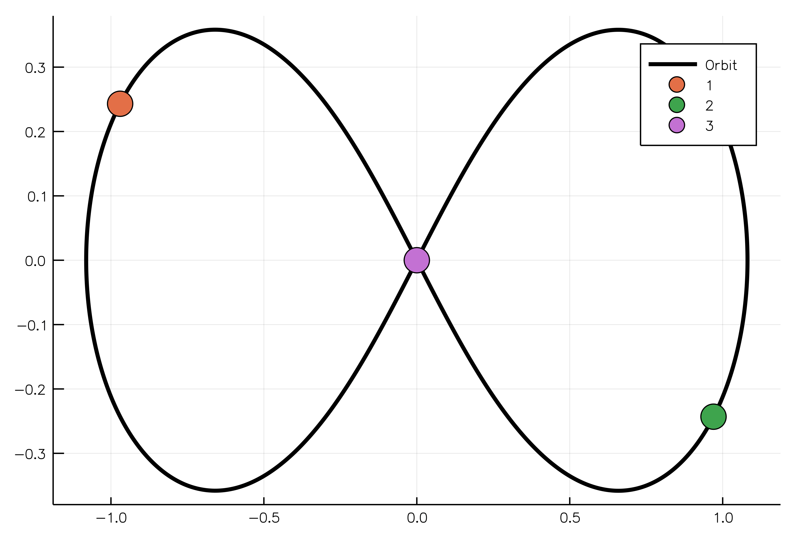
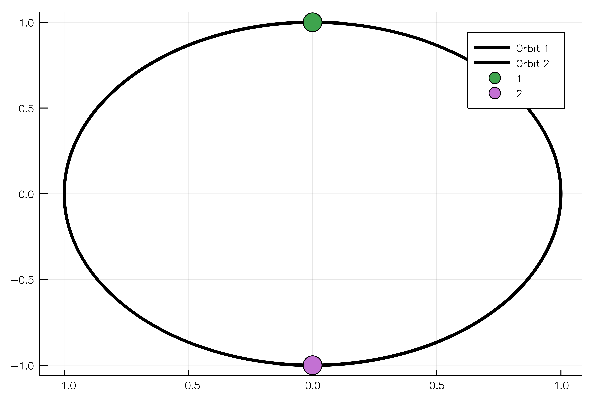
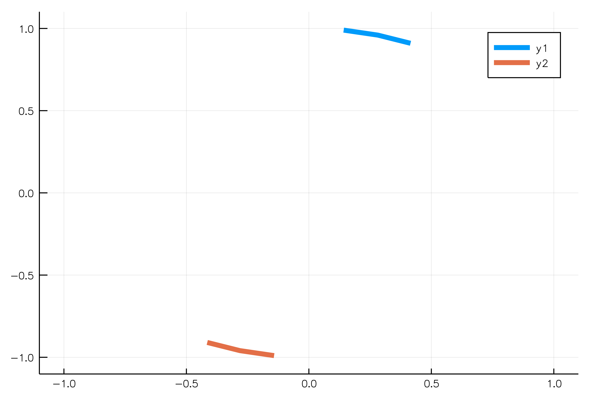

# Attempt to implement a solution to the N-body problem
This is the famous 3-body choreography called the figure 8, evidently reflecting the shape of the bodies' orbits.



## Usings
```julia
using NBodyGravitational, DifferentialEquations, Plots, StaticArrays
```
## Defining bodies

In order to create bodies/particles for the problem, one needs to use the MassBody structure and its constructor, which accepts mass, initial coordinates and velocity of the body.

```julia
body1 = MassBody(2.0, SVector(0.0,1.0,0.0), SVector(5.775e-6,0.0,0.0))
body2 = MassBody(2.0, SVector(0.0,-1.0,0.0), SVector(-5.775e-6,0.0,0.0))
```

Usually we solve an n-body problem for a certain period of time:

```julia
tspan = (0.0, 1111150.0);
```

Solving gravitational problem one needs to specify the gravitational constant G.
```julia
grav_const = 6.673e-11
```

In fact, now we have enough parameters to create an NBodyGravProblem object:

```julia
problem = NBodyGravProblem([body1,body2], tspan, G)
```

Solution to the problem might be evaluated using the standard `solve` function:
```julia
solution = solve(problem);
```

And, finally, we plot our solution showing two equal bodies rotating on the same orbit:
```julia
plot_xy_scattering(solution,"./anim_two_boddies_scattering.gif")
```



There is another type of gif-plots for moving objects. Imagine, we want to observe only the moving bodies without trajectory curves but with a slight hint for their orbtis. In this case we need to build a trailing plot:
```julia
plot_xy_trailing(solution, "./anim_two_boddies_trailing.gif", ntrail = 3, duration = 3.0)
```

